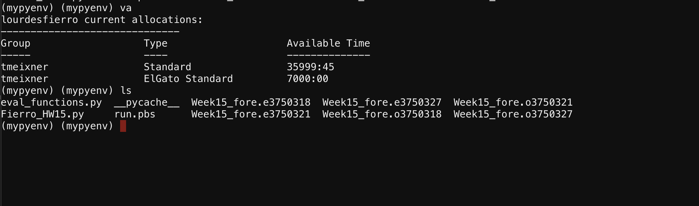
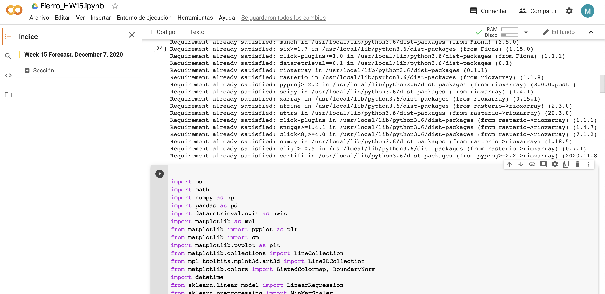

# Week 15 Forecast. Lourdes Fierro
## December 7, 2020.

### Grade
3/3 - Nice job!  We will hopefully get time to discuss questions tomorrow but I put some quick answers below your questions.

### Reflection

1. What resources did you request on Ocelote? How long did you wait in the queue for your job to run and how long did it take to run?
I requested 1 node, 1 core, standard queue, and 05:00 minutes of cpu time. I waited for the job to be submitted less than ten seconds. It took six seconds to run.
2. What was the most confusing part to you about setting up and running your job on Ocelote?
- I was unsure about the account setup at the beginning, as well as the pip installation (I was unsure whether the one package would have conflicts with others)

3. Where else did you run your job? How did the setup compare to your run on Ocelote?
- I used Google colab. The code structure is similar in both cases, however, in Google colab I don't need to run a pbs file or/and submit the job (for now). Also, I can share my code and receive feedback directly from the online platform, while in Ocelote I would have to download and email the code/script.

4. What questions do you still have after doing this?
- In the case of google colab, I'm not sure if I need to pip install all packages every time I run a script. Is there a way to set/create an environment (similar to Ocelote machine)?
  - Good question, I think so but I'm not sure how. 
- How can function files be called in the main script (Google colab)?
  - It should work the same as with your other python scripts  you will just need to upload a py file with the functions and source it.
- What happens if the time resources in Ocelote run out? Can I request more time?
  - Nope. You can either run in the windfall queue or wait for the allocation to be renewed at the beginning of the following month.
- Can I use data stored in Ocelote in a script running with  Google colab?
 - Nope you will have to upload it there for it  to have access.

Notes: I ran the jupyter notebook in google colab, and a python file in Ocelote.
